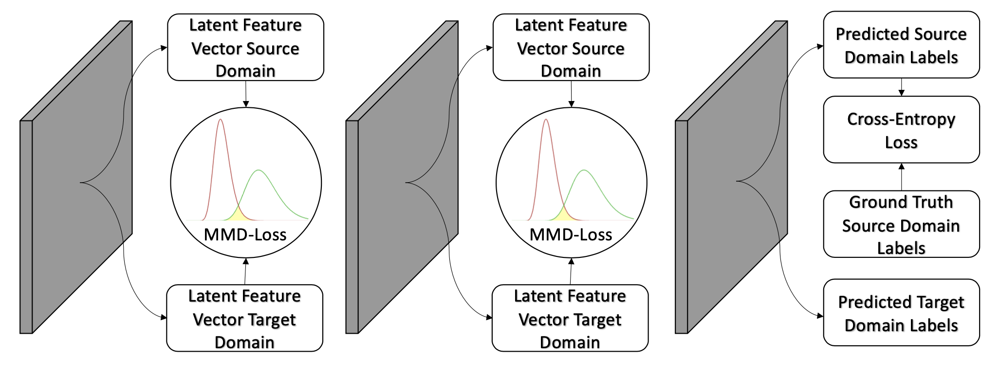
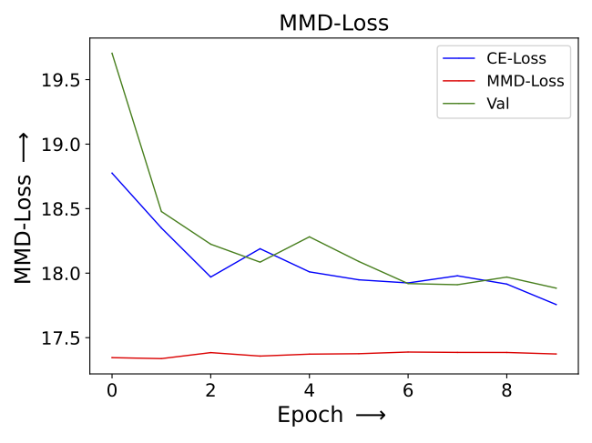

# Installation and Usage
All computations were performed on a Leibniz Supercomputing Centre7 compute node virtual machine with 20 Intel® Xeon® Gold 6148 vCPUs, one Nvidia® Tesla V100, 368 GB RAM, PyTorch v.1.4.0 and CUDA 10.1 in combination with python 3.8.

The folder CODE_DUMMY_DATA contains all CODE which was used with the synthetically generated dummy dataset. The folder CODE_REAL_DATA contains all CODE which was used with the recorded signals from the DMG DMC 55H duoblock milling machine.

## 1. Install necessary python 3 packages from the file requirements.txt:
* Go to the folder with the downloaded repository
* Install necessary packages: ```pip install -r requirements.txt```

## 2. Specify Model Training
Open bash file experiment_model_start.sh to adapt the training:
* gpu_name
* num_epochs
* GAMMAs
* GAMMA_reduction
* num_pool
* MMD_layer_activation_flag_FULL
* MMD_layer_activation_flag_FC
* MMD_layer_activation_flag_CNN
* features_of_interest
* class_0_labels
* class_1_labels

## 3. Execute Model Training
Execute bash file experiment_model_start.sh to start the model training: ```bash experiment_model_start.sh```

## 3. Evaluate Models
A folder "experiments" was generated during the model training. The folder contains the data and plots for the learning curves (Accuracy, Cross Entropy Loss and Maximum Mean Discrepancy Loss for the source and target domains) as well as the data distribution in the penultimate hidden layer FC2 after epoch 0, 20, 40 and 80. Besides that, the best performing model during the training is stored as model_cnn.pt and model_fc.pt. The used hyperparameters are stored in the hyperparameters.txt to make the training more transparent for later evaluation. 


# Master's Thesis: Intelligent Ball Screw Fault Diagnosis Using Deep Learning Based Domain Adaptation and Transfer Learning

## Introduction
This Repository contains the Code for a deep learning-based domain adaptation Health Monitoring System for industrial applications. Since ball screw feed drives are widely used components in industrial machines, the developed system was evaluated on their degradation monitoring. A data set with recordings from a DMG DMC 55H duo Block feed drive in different wear states was provided by the [Institute for Machine Tools and Industrial Management]( https://www.mec.ed.tum.de/en/iwb/homepage/) ([The paper by Benker et al. describes the experimental setup and recorded daatset in more detail](https://link.springer.com/article/10.1007/s11740-021-01085-9))


In the course of the thesis data was recorded at the ball screw feed drives mounted in the machine tool's moving hanger assembly of a DMG DMC 55H duoblock milling machine of the manufacturer DMG Mori. Due to varying working conditions, prognostics and health management systems must be developed robust enough to handle continuous changes in the fault characteristics of industrial machines. Throughout the proposed model training, the domain shift in the latent feature spaces of the model is measured and reduced by a Maximum Mean Discrepancy Loss. 

## Model & Model Training
The architecture of the proposed PHM model, which is visualized in fig.1, consists of an one-dimensional CNN and a subsequent classifier. The CNN extracts expressive features, which are later used by the classifier to predict the health condition of the ball screw drives. After iteratively applying convolutional, pooling and batch normalization layers, the output of the CNN is flattened and normalized to an one-dimensional vector. This vector is fed to the subsequent classifier. The repetitive model training is separated into two phases. In the first phase, a weighted average of Cross Entropy Loss and Maximum Mean Discrepancy Loss is used to optimize the whole network. In the second phase, only the Cross Entropy Loss is applied to optimize the final layers of the classifier. 


                                          

<p align="center">
  <br>
  <strong>Fig. 1: </strong> Model Architecture and Traing Phases.
</p>

The Maximum Mean Discrepancy Loss estimates the domain discrepancy in the latent feature maps of the neural network. The Maximum Mean Discrepancy Loss facilitates the extraction of domain-invariant features. The domain discrepancy is measured as the squared distance between the distribution kernel embeddings in the reproducing kernel Hilbert space. The Maximum Mean Discrepancy Loss is applied in several layers of the CNN and classifier. The Cross Entropy Loss, which is applied in the final layer of the classifier, optimizes the model to increase the classification accuracy on the source domain data. The application of the different losses during the training is visualized in fig.2.
                                          

 <p align="center">
  <br>
  <strong>Fig. 2: </strong> Extraction of Maximum Mean Discrepancy and Cross Entropy Loss
</p>                                   
                                          
## Research Questions
The thesis is centered around three main research questions. These research questions were defined beforehand to guarantee a structured development of the PHM systems. The questions were formulated based on common problems and challenges in the domain adaptation and the PHM community. In order to evlaluate the deep learning-based domain adaptation Health Monitoring System in the context of these formulated research questions, it was evaluated on a synthetic dummy dataset.

### Influence of the GAMMA Choice on the Domain Adaptation Performance

Since the source and target domains are correlated to some extent, the network itself can extract domain-independent features. The powerful CNN learned from the source domain can also increase the model performance on the target domain. At the same time, features that are too sensitive to the source domain can reduce the model performance on the target domain. To counteract that phenomenon, domain adaptation approaches can help to transfer knowledge learned from the source to the target domain. However, one has to pay attention to not transfer noise or irrelevant information since this destroys the structure of the source and target domain data and makes the classification task even more difficult. For this reason, it is essential to precisely balance the Maximum Mean Discrepany and Cross Entropy Loss. This thesis investigates the effects of different weighting factors, called GAMMA, on the model training. The Maximum Mean Discrepany and Cross Entropy Loss are balanced by the hyperparameter GAMMA:
```math
Total~Loss = Cross~Entropy~Loss + GAMMA · Maximum~Mean~Discrepany~Loss,
```

***
#### Results

<strong>Small GAMMA (0.001):</strong> <br>
When a very small GAMMA was selected, the source CE-loss was reduced (see figure 3a), whereas the MMD-loss was increased throughout the training (see figure 3d). This showed the dominance of the source CE-loss. Instead of reducing the domain discrepancy, the model training focused on predicting the source samples correctly. The model’s performance was solely improved on the source domain but the knowledge was not properly transferred to the target domain. Since the influence of the MMD- loss was negligible, the domain discrepancy was not reduced properly. Therefore, the separability and compactness of the classes were low and the class representations did not overlap properly across the domains (see figure 4d).<br>
<strong>Medium GAMMA (0.1):</strong> <br>
When the GAMMA was chosen correctly, the source CE- and MMD-loss were reduced simultaneously (see figure 3b and 3e). For this GAMMA choice, the model was optimized to correctly classify the source domain samples while reducing the domain discrepancy. Knowledge learned from the source domain was successfully transferred to the target domain. In this case, the training profited from both losses equally. An optimization with multiple goals was achieved and neither of them solely dominated the training. Compared to the smaller GAMMA choice, the class distributions in the latent feature space showed increased compactness and separability of the classes in both domains (see figure 4e). Especially for class 1, the point clouds were more dense and there were fewer outliers far away from their corresponding class center (see figure 4e). The distance between different classes was increased and the subspace separating those was less dense (see figure 4e). The point clouds of equal classes were structured more similarly and their overlap was improved (see figure 4e). This showed that the samples were successfully transferred in a more domain-invariant feature space, where the domain discrepancy was reduced.<br>
<strong>Large GAMMA (20):</strong> <br>
When a very large GAMMA was selected, the MMD-loss was reduced efficiently (see figure 3f), whereas the source CE-loss was increased throughout the training (see figure 3c). The correct prediction of source domain samples became irrelevant. Since the target labels were unknown, the MMD-loss was calculated between source and target domain samples of the same and different classes. Therefore, the MMD-loss reduced the inter- and intra-class distance between the latent feature representations of the source and target domain. The compactness of the classes was increased but their separability was reduced. This led to a trivial solution, where all latent feature representations collapsed to a point- or needle-like subspace (see figure 4f). The classification task became more challenging for that specific latent feature representation.<br>


<table style="margin-left: auto; margin-right: auto; table-layout: fixed; width: 100%">
  <tr>
    <td style="width: 48%;"> </td>
    <td style="width: 48%;"> </td>
    <td style="width: 48%;"> </td>
  </tr>
  <tr>
    <td style="width: 48%;" valign="top"> <b>Fig.3a:</b> Cross Entropy Loss: Dominant Cross Entropy Loss.
    </td>
    <td style="width: 48%;" valign="top">  <b>Fig.3b:</b> Cross Entropy Loss: Balanced Cross Entropy and Maximum Mean Discrepancy Loss.
    </td>
    <td style="width: 48%;" valign="top">  <b>Fig.3c:</b> Cross Entropy Loss: Dominant Maximum Mean Discrepancy Loss.
    </td>
  </tr>
</table>

<table style="margin-left: auto; margin-right: auto; table-layout: fixed; width: 100%">
  <tr>
    <td style="width: 48%;"> </td>
    <td style="width: 48%;"> </td>
    <td style="width: 48%;"> </td>
  </tr>
  <tr>
    <td style="width: 48%;" valign="top"> <b>Fig.3d:</b> Maximum Mean Discrepancy Loss: Dominant Cross Entropy Loss.
    </td>
    <td style="width: 48%;" valign="top">  <b>Fig.3e:</b> Maximum Mean Discrepancy Loss: Balanced Cross Entropy and Maximum Mean Discrepancy Loss.
    </td>
    <td style="width: 48%;" valign="top">  <b>Fig.3f:</b> Maximum Mean Discrepancy Loss: Dominant Maximum Mean Discrepancy Loss.
    </td>
  </tr>
</table>


<table style="margin-left: auto; margin-right: auto; table-layout: fixed; width: 100%">
  <tr>
    <td style="width: 48%;"> </td>
    <td style="width: 48%;"> </td>
    <td style="width: 48%;"> </td>
  </tr>
  <tr>
    <td style="width: 48%;" valign="top"> <b>Fig.4a:</b> Data Distribution in FC2: Dominant Cross Entropy Loss (Epoch 0).
    </td>
    <td style="width: 48%;" valign="top">  <b>Fig.4b:</b> Data Distribution in FC2: Balanced Cross Entropy and Maximum Mean Discrepancy Loss (Epoch 0).
    </td>
    <td style="width: 48%;" valign="top">  <b>Fig.4c:</b> Data Distribution in FC2: Dominant Maximum Mean Discrepancy Loss (Epoch 0).
    </td>
  </tr>
</table>

<table style="margin-left: auto; margin-right: auto; table-layout: fixed; width: 100%">
  <tr>
    <td style="width: 48%;"> </td>
    <td style="width: 48%;"> </td>
    <td style="width: 48%;"> </td>
  </tr>
  <tr>
    <td style="width: 48%;" valign="top"> <b>Fig.4d:</b> Data Distribution in FC2: Dominant Cross Entropy Loss (Epoch 8).
    </td>
    <td style="width: 48%;" valign="top">  <b>Fig.4e:</b> Data Distribution in FC2: Balanced Cross Entropy and Maximum Mean Discrepancy Loss (Epoch 8).
    </td>
    <td style="width: 48%;" valign="top">  <b>Fig.4f:</b> Data Distribution in FC2: Dominant Maximum Mean Discrepancy Loss (Epoch 8).
    </td>
  </tr>
</table>

### Domain Adaptation Performance of the Labeled Maximum Mean Discrepancy Loss

In this thesis a novel labeled Maximum Mean Discrepancy Loss was developed, which minimizes the domain discrepancy between samples of the same class and maximizes the domain discrepancy between samples of different classes. This novel Maximum Mean Discrepancy Loss directly considers the labels of the source and target domain. The target labels are not used in the Cross Entropy Loss. The advantages and disadvantages of the labeled maximum Maximum Mean Discrepancy Loss over the unlabeled Maximum Mean Discrepancy Loss are further analyzed in this thesis.

***
#### Results

Figure 5 visualizes the FC2 latent feature representations of the source and target domain samples during different epochs. Compared to the unlabeled Maximum Mean Discrepancy Loss, the labeled Maximum Mean Discrepancy Loss more efficiently reduced the domain discrepancy while increasing the separability and compactness of the classes in both domains. The following observations in figure 5 proved these advantages of the labeled Maximum Mean Discrepancy Loss over the unlabeled Maximum Mean Discrepancy Loss:
* <strong>Separability:</strong> The distance between the classes was substantially increased and the separating subspace was less dense.
* <strong>Compactness:</strong> The samples belonging to the same class were represented in a more distinct subset. The distance of the samples to their corresponding class center was reduced.
* <strong>Domain Discrepancy:</strong> The subsets corresponding to the same classes overlapped more across the domains.

These improvements, achieved by the labeled Maximum Mean Discrepancy Loss, simplified the classification problem. In a research aspect, the application of the labeled Maximum Mean Discrepancy Loss was particularly interesting as it revealed the deficits of the unlabeled Maximum Mean Discrepancy Loss. Due to the lack of target labels, the unlabeled Maximum Mean Discrepancy Loss equally minimizes the intra- and inter-class domain discrepancy. Therefore, the unlabeled Maximum Mean Discrepancy Loss is more prone to minimizing the classes’ separability while reducing the domain discrepancy. When the effect of the unlabeled Maximum Mean Discrepancy Loss becomes too dominant, the separability of the classes is destroyed. In this case, the optimization ends up in a trivial solution, in which the latent feature representations of all samples collapse to a point- or needle-like subspace (see last row of figure 6.2). To prevent that, the GAMMA of the unlabeled Maximum Mean Discrepancy Loss must be selected precisely. Due to the separate optimization of the domain discrepancy between samples of equal and different classes, the model training with the labeled Maximum Mean Discrepancy Loss is less prone to the previously described trivial solution. Therefore, the influence of the labeled Maximum Mean Discrepancy Loss can be increased during the optimization. This enables a more efficient domain discrepancy reduction while improving the classes’ separability and compactness. Due to the lower sensitivity to the GAMMA choice, GAMMA_Inter_Class and GAMMA_Intra_Class of the labeled Maximum Mean Discrepancy Loss were both chosen to be 30 in the experiments. A GAMMA of 0.1 had to be selected for the unlabeled Maximum Mean Discrepancy Loss to not reduce the separability between the classes while reducing the domain discrepancy.

<table style="margin-left: auto; margin-right: auto; table-layout: fixed; width: 100%">
  <tr>
    <td style="width: 48%;"> </td>
    <td style="width: 48%;"> </td>
  </tr>
  <tr>
    <td style="width: 48%;" valign="top"> <b>Fig.5a:</b> Data Distribution in FC2: Unlabeled Maximum Mean Discrepancy Loss (Epoch 0).
    </td>
    <td style="width: 48%;" valign="top">  <b>Fig.5b:</b> Data Distribution in FC2: Labeled Maximum Mean Discrepancy Loss (Epoch 0).
    </td>
  </tr>
</table>

<table style="margin-left: auto; margin-right: auto; table-layout: fixed; width: 100%">
  <tr>
    <td style="width: 48%;"> </td>
    <td style="width: 48%;"> </td>
  </tr>
  <tr>
    <td style="width: 48%;" valign="top"> <b>Fig.5c:</b> Data Distribution in FC2: Unlabeled Maximum Mean Discrepancy Loss (Epoch 8).
    </td>
    <td style="width: 48%;" valign="top">  <b>Fig.5d:</b> Data Distribution in FC2: Labeled Maximum Mean Discrepancy Loss (Epoch 8).
    </td>
  </tr>
</table>

### Influence of the Latent Feature Space Choice on the Domain Adaptation Performance
Most domain adaptation approaches reduce the domain discrepancy in the task-specific layers and use a shared CNN backbone across all domains. Throughout the neural network, the feature maps extract information with different levels of abstraction. Since feature maps influence all subsequent ones, propagating the biased data through the neural network facilitates the domain shift. Reducing the domain discrepancy in only task-specific layers might minimize but not completely eliminate it. This thesis investigates how applying the Maximum Mean Discrepancy Loss in different model layers can improve the domain discrepancy reduction. In this context, a particular focus lies on the layers of the CNN.

***
#### Results

Two different Maximum Mean Discrepancy Loss types were developed and afterward compared on the dummy dataset. Tab. 1 specifies the layers of the neural network considered by those Maximum Mean Discrepancy Loss types:

<p align="center">
  <br>
  <strong>Tab. 1: </strong> Overview of the latent feature maps included in the different Maximum Mean Discrepancy Loss types
</p>

The development of the source accuracy, target accuracy, source CE-loss and Maximum Mean Discrepancy Loss throughout the executed model training are visualized in figure 6, 7, 8 and 9. When using the CNN feature maps in the Maximum Mean Discrepancy Loss, higher source and target accuracies were achieved (see figure 6 and 7). The increased classification performance in both domains indicated that the domain discrepancy was reduced more efficiently by the CNN Maximum Mean Discrepancy Loss. Additionally, the losses converged faster and smoother (see figure 8 and 9). This proves the increased training stability when applying the Maximum Mean Discrepancy Loss in the CNN layers. When estimating the Maximum Mean Discrepancy Loss in the fully-connected layers, it seemed like the two training goals of the Maximum Mean Discrepancy Loss and source Cross Entropy loss were contradicting. The model training appeared to be more prone to get stuck in local minima. This was mainly reflected by the training instabilities in the FC Maximum Mean Discrepancy-based model training. The resulting fluctuations are observable in the development of the source and target accuracies (see figure 6 and 7) and in the loss curves (see figure 8 and 9).

<table style="margin-left: auto; margin-right: auto; table-layout: fixed; width: 100%">
  <tr>
    <td style="width: 48%;"> </td>
    <td style="width: 48%;"> </td>
  </tr>
  <tr>
    <td style="width: 48%;" valign="top"> <b>Fig.6a:</b> Source accuracy - CNN MMD-loss: Influence of the MMD layer choice on the model training.
    </td>
    <td style="width: 48%;" valign="top">  <b>Fig.6b:</b> Source accuracy - FC MMD-loss: Influence of the MMD layer choice on the model training.
    </td>
  </tr>
</table>

<table style="margin-left: auto; margin-right: auto; table-layout: fixed; width: 100%">
  <tr>
    <td style="width: 48%;"> </td>
    <td style="width: 48%;"> </td>
  </tr>
  <tr>
    <td style="width: 48%;" valign="top"> <b>Fig.7a:</b> Target accuracy - CNN Maximum Mean Discrepancy Loss: Influence of the Maximum Mean Discrepancy layer choice on the model training.
    </td>
    <td style="width: 48%;" valign="top">  <b>Fig.7b:</b> Target accuracy - FC Maximum Mean Discrepancy Loss: Influence of the Maximum Mean Discrepancy layer choice on the model training.
    </td>
  </tr>
</table>

<table style="margin-left: auto; margin-right: auto; table-layout: fixed; width: 100%">
  <tr>
    <td style="width: 48%;"> </td>
    <td style="width: 48%;"> </td>
  </tr>
  <tr>
    <td style="width: 48%;" valign="top"> <b>Fig.8a:</b> Cross Entropy Loss - CNN Maximum Mean Discrepancy Loss: Influence of the Maximum Mean Discrepancy layer choice on the model training.
    </td>
    <td style="width: 48%;" valign="top">  <b>Fig.8b:</b> Cross Entropy Loss - FC Maximum Mean Discrepancy Loss: Influence of the Maximum Mean Discrepancy layer choice on the model training.
    </td>
  </tr>
</table>

<table style="margin-left: auto; margin-right: auto; table-layout: fixed; width: 100%">
  <tr>
    <td style="width: 48%;"> </td>
    <td style="width: 48%;"> </td>
  </tr>
  <tr>
    <td style="width: 48%;" valign="top"> <b>Fig.9a:</b> Maximum Mean Discrepancy Loss - CNN Maximum Mean Discrepancy Loss: Influence of the Maximum Mean Discrepancy layer choice on the model training.
    </td>
    <td style="width: 48%;" valign="top">  <b>Fig.9b:</b> Maximum Mean Discrepancy Loss - FC Maximum Mean Discrepancy Loss: Influence of the Maximum Mean Discrepancy layer choice on the model training.
    </td>
  </tr>
</table>

## Overall Prognostics and Health Management Performance

In this chapter, different Maximum Mean Discrepancy (MMD) Loss types are evaluated on the real-world ball screw drive dataset, which was recorded on the milling machine. This is done by comparing the performance of models trained with those Maximum Mean Discrepancy Loss types. The performance was measured by the models’ accuracy on the target domain test dataset. The evaluation of the Maximum Mean Discrepancy Loss types types required several stages of experiments. In the first stage, all of the 49 signals, recorded on the miling machine, were evaluated by their suitability for PHM tasks. The models were trained on these signals without applying any Maximum Mean Discrepancy Loss. Based on the performance of the resulting models, seven promising signals were selected for further testing. In the second stage, the models were optimized with different Maximum Mean Discrepancy-based training strategies on those seven signals. The models were optimized with FULL MMD-, FC MMD- and CNN MMD Losses and three different GAMMA choices (0.05, 0.5, 1). In tab. 2 the FULL MMD-, FC MMD- and CNN MMD-Losses are specified:

<p align="center">
  <br>
  <strong>Tab. 2: </strong> Overview of the latent feature maps included in the different Maximum Mean Discrepancy Loss types
</p>

All nine Maximum Mean Discrepancy-based model training (all combinations of MMD-loss types and GAMMAs) and the baseline model training that did not apply any Maximum Mean Discrepancy Loss were repeated five times on all seven signals. During each epoch in the model training, the models were evaluated based on the balanced accuracy on the target domain validation dataset and the best-performing model was stored. The different Maximum Mean Discrepancy Loss types were compared by the performance of those stored models on the unseen target domain test dataset.
For each training strategy (specific Maximum Mean Discrepancy Loss type and GAMMA choice), the accuracies achieved by the five equally trained models on the target domain test dataset were averaged. The results are shown in tab. 3. The FULL MMD models performed best on four of the seven signals and the CNN MMD models on the other three. The FC MMD models never outperformed the other MMD-based models. Compared to the baseline model, the MMD-based models increased the accuracy on the target domain test dataset by up to 10.18%. Tab. 4 shows the standard deviations corresponding to the averaged accuracies seen in tab. 3. The best-performing models usually showed low to average standard deviations, which verifies a high degree of reproducibility throughout the repeated model training. This demonstrates the relevance of the results and proves the applicability and utility of the corresponding MMD-losses for reducing the domain discrepancy in the PHM task. For all training strategies (BASELINE, FULL MMD, FC MMD, CNN MMD) the calculated standard deviations were averaged in the last column of tab. 4. For the MMD-based model training, the average standard deviations were calculated over all signals and GAMMAs and for the baseline model training over all signals. From the MMD-based models, the FULL MMD models had the lowest average standard deviation and the FC MMD models had the highest. This proves that the FULL MMD models achieved the most consistent performance throughout repeated training with different GAMMAs and on different signals. Therefore, the FULL MMD-based model training is more robust and less sensitive to GAMMA and signal choices. A reason for the sensitivity of the FC MMD-based model training to the GAMMA and signal choices might be the contradicting training goals when evaluating the MMD- and the source CE-loss solely in the FC layers. In this case, the training might be more prone to getting stuck in local minima, which leads to instabilities during the optimization. Furthermore, the results achieved by the different MMD-loss types strongly depended on the GAMMA choices. In the FULL MMD-based model training on the D:P_mech./X signal, varying GAMMA choices led to accuracy differences of nearly 30%.

<p align="center">
  <br>
  <strong>Tab. 3: </strong> Average target test accuracy (%)
</p>

<p align="center">
  <br>
  <strong>Tab. 4: </strong> Standard deviation test accuracy (%)
</p>
